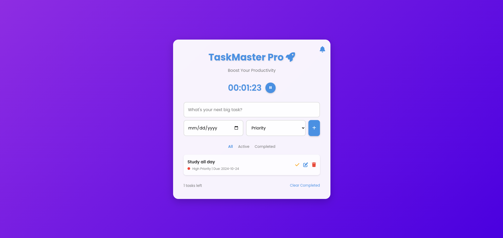

# TaskMaster Pro

## 📋 Overview

**TaskMaster Pro** is a simple and intuitive to-do list application designed to boost your productivity and help you manage your tasks efficiently. With a clean, modern interface and a range of features, TaskMaster Pro makes it easy to organize, prioritize, and track your daily tasks.

## 🚀 Features

- **Intuitive Task Management**: Easily add, edit, and delete tasks.
- **Priority Levels**: Assign low, medium, or high priority to your tasks.
- **Due Dates**: Set due dates for your tasks to stay on schedule.
- **Task Filtering**: Quickly filter tasks by all, active, or completed status.
- **Productivity Timer**: Built-in timer to help you focus on your tasks.
- **Smart Notifications**: Get notified when tasks are due or overdue.
- **Local Storage**: Your tasks are saved locally, so you never lose your to-do list.
- **Responsive Design**: Works seamlessly on desktop and mobile devices.



## 🛠 Installation

To set up the **TaskMaster Pro** project locally, follow these steps:

1. Clone the repository:
```
git clone https://github.com/deezyfg/taskmaster-pro.git
```

2. Navigate to the project directory:
```
cd taskmaster-pro
```

3. Open `index.html` in your preferred web browser.

## 🖥 Usage

1. **Adding a Task**: 
- Type your task in the input field.
- Set a due date and priority level.
- Click the "+" button or press Enter to add the task.

2. **Editing a Task**:
- Click the edit icon next to a task.
- Modify the task details.
- Click the save button to update the task.

3. **Completing a Task**:
- Click the checkbox next to a task to mark it as complete.

4. **Deleting a Task**:
- Click the delete icon next to a task to remove it.

5. **Filtering Tasks**:
- Use the "All", "Active", and "Completed" buttons to filter your tasks.

6. **Using the Timer**:
- Click the timer button to start/pause the productivity timer.


## 🌐️ Technologies Used

- HTML5
- CSS3
- JavaScript (ES6+)
- Local Storage API
- Web Notifications API

## 🤝 Contributing

Contributions are welcome! Please feel free to submit a **Pull Request**.

1. Fork the repository
2. Create your feature branch (e.g., `git checkout -b feature/AmazingFeature`)
3. Commit your changes (e.g.,`git commit -m 'Add some AmazingFeature'`)
4. Push to the branch (e.g.,`git push origin feature/AmazingFeature`)
5. Open a Pull Request

## 📝 License

This project is licensed under the MIT License - see the [LICENSE.md](LICENSE.md) file for details.

## 🙏 Acknowledgments

- [Font Awesome](https://fontawesome.com/) for the icons
- [Google Fonts](https://fonts.google.com/) for the typography

## 📧 Contact

- **Name:** [Peter Opoku-Mensah](https://github.com/deezyfg/code-haven)  
  - **Email:** [mensahpeter421@gmail.com](mailto:mensahpeter421@gmail.com)

- **Project Link:** [TaskMaster Pro Repository](https://github.com/deezyfg/taskmaster-pro)
